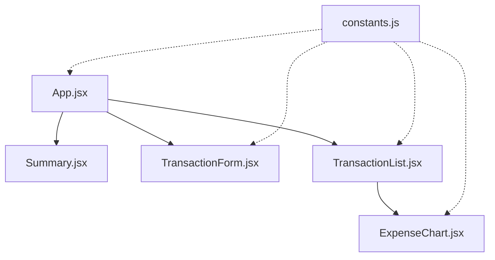

# SpendWise | Premium Personal Finance Orchestrator

SpendWise is a premium wealth tracking and personal finance dashboard. Crafted with modern styling paradigms—featuring translucent glass surfaces, dynamic layout grids, and interactive data visualization charts—it provides a cohesive and responsive user experience to manage, filter, and analyze transactions.

Developed by **[Prathamesh-Labs](https://github.com/Prathamesh-Labs)**.

---

## ✨ Features

- **Obsidian Glassmorphism UI**: A dark theme built using a custom color system, translucent surfaces, and soft box-shadow depths (`radial-gradient` backgrounds).
- **Interactive Analytics**: Horizontal category-wise expense distribution bar charts using **Recharts** with interactive hover tooltips.
- **Ledger Timeline**: Replacing generic grid databases, transactions are presented as modern, horizontal card-strips with type directional markers, badge categories, and inline deletion actions.
- **Dynamic Cashflow Glows**: Card surfaces feature hover glows (emerald green for income, rose red for expenses, indigo blue for balance) that react to user inputs.
- **Top-Center High-Contrast Alerts**: Screen-centered slide-down toast notifications featuring built-in visual progress countdown timers (3 seconds).
- **Search & Advanced Filters**: Multi-criteria search filters, select inputs for types/categories, and sorting controls (Newest Date, Oldest Date, Highest Amount, Lowest Amount) built into the ledger.
- **Auto-Sync LocalStorage**: Real-time state persistence to local storage cache with data sanitization hooks to automatically migrate legacy caches.

---

## 🛠️ Architecture

SpendWise is structured following modular components to separate data calculations, inputs, and listings:



- **[App.jsx](src/App.jsx)**: Serves as the primary coordinator, loading/sanitizing data, managing global transactions state, and handle triggers.
- **[Summary.jsx](src/components/Summary.jsx)**: Focuses on balance math: calculating total income, total outflow, and current balances dynamically.
- **[TransactionForm.jsx](src/components/TransactionForm.jsx)**: Manages new item inputs, local input validation rules, and category selects.
- **[TransactionList.jsx](src/components/TransactionList.jsx)**: Manages search queries, filters, custom sort filters, and renders the ledger cards.
- **[ExpenseChart.jsx](src/components/ExpenseChart.jsx)**: Handles Recharts rendering and outputs a horizontal bar chart mapping active expense values.
- **[constants.js](src/constants.js)**: Declares configuration constants (like category definitions) shared between modules.

---

## 🚀 Getting Started

### Prerequisites

Make sure you have [Node.js](https://nodejs.org/) installed on your machine.

### Installation

1. Clone the repository:
   ```bash
   git clone https://github.com/Prathamesh-Labs/Spendwise.git
   cd Spendwise
   ```

2. Install dependencies:
   ```bash
   npm install
   ```

3. Run the development server locally:
   ```bash
   npm run dev
   ```

4. Compile the production bundle:
   ```bash
   npm run build
   ```

---

## 🎨 Styling Specifications

SpendWise utilizes custom CSS variables declared in `index.css` to build design tokens:

| Property | Value | Description |
| :--- | :--- | :--- |
| `--bg-primary` | `#05070e` | Midnight obsidian navy-black base |
| `--bg-card` | `rgba(10, 15, 30, 0.45)` | Translucent glass container fill |
| `--primary` | `#6366f1` | Indigo accent theme |
| `--income` | `#10b981` | Emerald green success color |
| `--expense` | `#f43f5e` | Rose aura warning color |
| `--font-sans` | `'Plus Jakarta Sans'` | Display and body geometric sans-serif |
